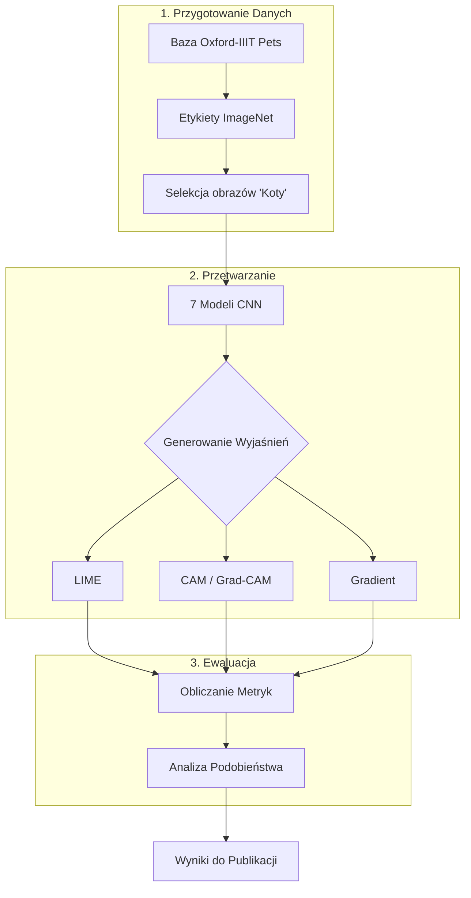

# Analysis of Saliency Maps Similarity in CNN Models

Projekt poświęcony analizie porównawczej metod wyjaśnialnej sztucznej inteligencji (**XAI**). Skupia się na generowaniu i ocenie map istotności (saliency maps) przy użyciu technik opartych na **CAM**, **LIME** oraz **gradientach** dla siedmiu różnych architektur sieci neuronowych (CNN).
## 📊 Schemat Procesu (Workflow)

Poniższy diagram przedstawia architekturę całego eksperymentu:

## 🚀 Przegląd Projektu

Celem badania jest sprawdzenie, na ile spójne są wyjaśnienia generowane przez różne algorytmy XAI. Eksperyment wykorzystuje obrazy z bazy [Oxford-IIIT Pet Dataset](https://www.robots.ox.ac.uk/~vgg/data/pets/) (stan na listopad 2025) oraz etykiety zgodne z klasyfikacją [ImageNet](https://raw.githubusercontent.com/pytorch/hub/master/imagenet_classes.txt).

### Kluczowe etapy eksperymentu:
1.  **Klasyfikacja:** Wykorzystanie 7 modeli CNN do rozpoznania obrazów.
2.  **Selekcja:** Wybór zdjęć, które zostały sklasyfikowane jako klasy "kocie".
3.  **Generowanie XAI:** Utworzenie map istotności metodami LIME, CAM i Gradient.
4.  **Ewaluacja:** Ilościowe porównanie map przy użyciu zaawansowanych metryk statystycznych.

## ⚙️ Instalacja
Aby zainstalować niezbędne biblioteki, uruchom:
`pip install -r requirements.txt`

---

