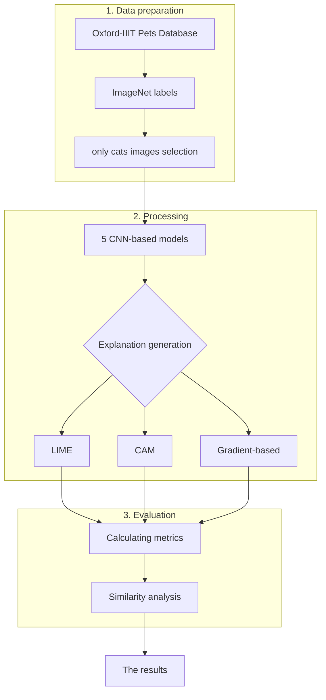

# Analysis of Saliency Maps Similarity in CNN Models

Comparative analysis of explainable AI (XAI) methods, focusing on saliency map generation and evaluation. The study utilizes **CAM**, **LIME**, and **gradient-based techniques** applied to five distinct **CNN architectures**.

## 📊 Workflow

The following diagram illustrates the architecture of the entire experiment:

## 🚀 Project review
The objective of this study is to evaluate the consistency of explanations generated by various XAI algorithms. The experiment utilizes images from the Oxford III-T Pet Dataset [(https://www.robots.ox.ac.uk/~vgg/data/pets/)] and labels corresponding to the ImageNet classification framework [(https://raw.githubusercontent.com/pytorch/hub/master/imagenet_classes.txt)].

### Kluczowe etapy eksperymentu:
1.  **Classification:** Utilizing 5 CNN-based models for image recognition.
2.  **Selection:** Selecting images classified into feline categories.
3.  **XAI Generation:** Generating saliency maps using LIME, CAM, and gradient-based methods.
4.  **Ewaluacja:** Quantitative comparison of the maps using advanced statistical metrics.

## ⚙️ Installation
To install the necessary libraries, run:
`pip install -r requirements.txt`

---

